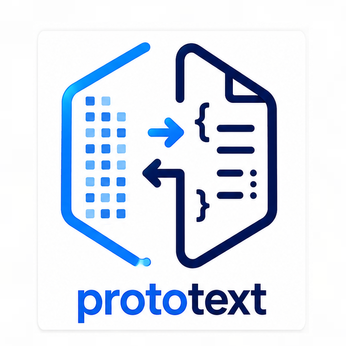
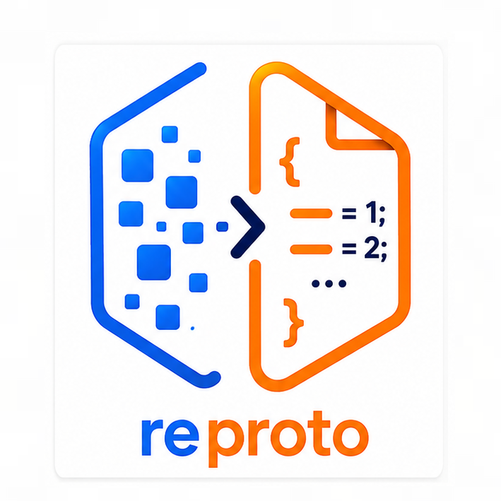

<!--
SPDX-FileCopyrightText: 2025-2026 Frederic Ruget <fred@atlant.is> (GitHub: @douzebis)
SPDX-FileCopyrightText: 2025-2026 THALES CLOUD SECURISE SAS

SPDX-License-Identifier: MIT
-->

# prototools

A collection of protobuf utilities for working with binary descriptors and
wire-format messages.

→ **[Tutorial: from first decode to schema inference](docs/tutorial.md)**

## Tools

### `prototext`



Lossless, bidirectional converter between binary protobuf wire format and
human-readable text.  Decodes with or without a schema; encodes annotated
prototext back to byte-exact binary.  Supports schema inference: given a
descriptor DB it ranks all candidate types and picks the best match.

→ See [`prototext/README.md`](prototext/README.md)

### `reproto`



Reconstructs compilable `.proto` source files from binary or text-format
`FileDescriptorSet` / `FileDescriptorProto` blobs.  Supports proto2, proto3,
and editions.  Output recompiles to a descriptor equivalent to the input.

→ See [`reproto/README.md`](reproto/README.md)

### `reproto-instantiate-schema`

Generates pseudo-random binary protobuf instances from a `.desc`
FileDescriptorSet.  Used to populate schema-DB test corpora and as a
quick sanity-check that a descriptor is well-formed.

```
reproto-instantiate-schema --descriptor-set my.desc --seed 42 -O out/ \
    google.type.PostalAddress google.protobuf.Timestamp
```

### `protoscan`

Scans binary files (shared libraries, executables, firmware images) for
embedded `FileDescriptorProto` blobs and extracts them as individual `.pb`
files, one per proto file descriptor found.  The extracted blobs can be
fed directly to `reproto` to recover `.proto` source.

```
protoscan --proto_out extracted/ some_binary
reproto --use-variant descriptor -O src/ -I extracted/ extracted/*.pb
```

## Installation

### Rust CLI (`prototext`)

```shell
cargo install prototext
```

### Python tools (`reproto`, `protoscan`, …)

```shell
pip install prototext-reproto   # reproto, reproto-instantiate-schema
pip install protoscan           # protoscan
pip install prototext-codec     # Python extension (lossless codec)
pip install prototext-graph     # Python extension (scoring graph)
pip install fdp-scan            # Python extension (descriptor scanner)
```

### NixOS / nix-shell

```shell
git clone https://github.com/ThalesGroup/prototools
cd prototools
nix-shell          # user shell — all tools on PATH
```

## License

MIT — see [`LICENSES/MIT.txt`](LICENSES/MIT.txt).
